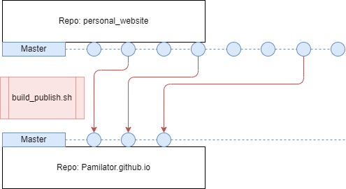

Hey there!

I'm excited to introduce you to my personal website, a space where I showcase my freelance journey and share my tech-related insights. As a data engineer and DevOps enthusiast, I wanted to create a platform that not only demonstrates my skills but also serves as a support to write about my projects and reflections.

# The Motivation Behind the Site
Being more inclined towards data engineering and DevOps, I never considered myself a web developer. However, I realized the importance of having an online presence to showcase my work and engage with the tech community. Hence, I decided to take on the challenge of building my website.

# Choosing Hugo and GitHub
As a non-web developer, I needed a static site generator that was easy to use and flexible. After some research, I came across Hugo, and it perfectly fit my requirements. Its simplicity and speed made the website development process smooth and enjoyable.

To host the website, I opted for GitHub Pages. This choice allowed me to keep my website code and content separate. I set up two separate GitHub repositories: "[personal_website](https://github.com/CedricFamin/personal_website)" to hold the raw Hugo code, and "[CedricFamin.github.io](https://github.com/CedricFamin/CedricFamin.github.io)" to publish the compiled version of the site.

# Blogging About Tech Insights
In addition to displaying my freelance projects, my website serves as a blog platform. Here, I regularly write about various tech-related topics, including data engineering best practices, DevOps automation, and emerging trends in the tech industry. Blogging not only helps me organize my thoughts but also allows me to contribute to the community's knowledge base.

Thanks for stopping by!